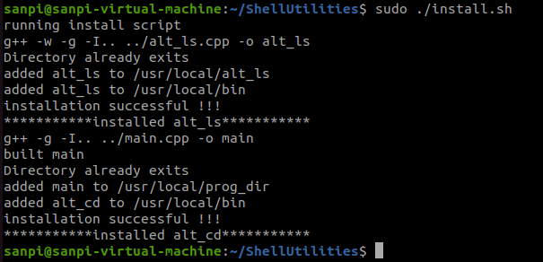
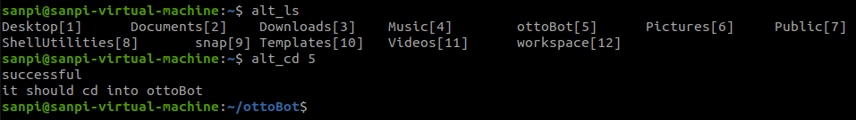

# Shell Utilities

## alternate cd and ls
##
Alternate ls lists directories and files alongside their index allowing user to change directory
using and integer index as opposed to typing out directories with long names.

## Dependencies
### install make
### insrall g++

## to do 
dependency checking in install script

## Getting started
### clone the main branch of this repo
### install by running install.sh script in the ShellUtilities directory

### Install

### Usage

